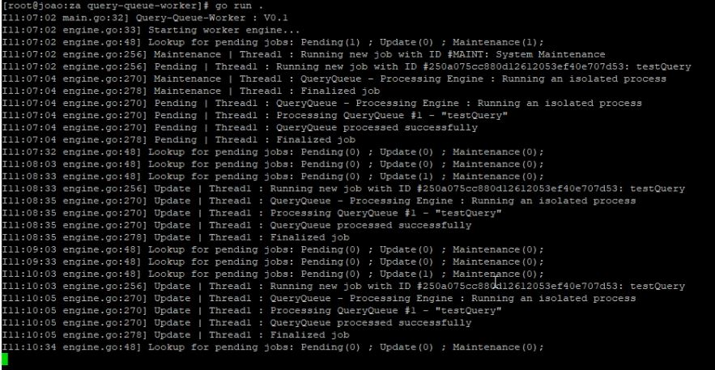

# Query-Queue-Worker

</br>
 A concurrent job worker for processing slow MYSQL queries.



## Introduction

Query Queue Worker is a GO application that in its essence runs and manages concurrent php processes. Its main focus is to lookup for queries previously added into a MYSQL table and launch isolated threads to run them.
This system was born out of a need to have multiple slow queries being executed and updated simultaneously.

Main tasks for this worker:

- Process new queries.
- Update existing queries, repeatedly, within a given time interval.
- Process maintenance tasks related with the 2 processes above.

## Requirements

- GO (version 1.16)

## Dependencies

- defaults ([github.com/creasty/defaults](https://github.com/creasty/defaults)) : Required to populate json data structure
- mysql ([github.com/go-sql-driver/mysql](https://github.com/go-sql-driver/mysql)) : Required to connect to MYSQL datasource
- tablewriter ([github.com/olekukonko/tablewriter](https://github.com/olekukonko/tablewriter)) : Required to show data in ASCII table
- logger ([github.com/antigloss/go/logger](https://github.com/antigloss/go/logger)) : Required to process logs

## Installation

1. Git clone this repo into a folder

2. Copy & edit the config sample file located in project root:

   ```
   cp sample-query-queue-config.json query-queue-config.json
   ```

3. Create a database schema and import `database.sql` file

4. Use the GO package manager to install required libs:

   ```
   go get ./...
   ```

## Usage

Query-Queue-Worker can be run with:

```sh
go run .
```

#### Available arguments:

Run the app with the following arguments

| Flag       | Description                                    | Accepted Values |
| ---------- | ---------------------------------------------- | --------------- |
| -h, --help | Shows help screen with all available arguments | --              |
| --silent   | Weather to show output on stdout               | true \| false   |

#### Available options:

While the app is running press keyboard to:

| Key    | Description                            |
| ------ | -------------------------------------- |
| q \| Q | Exit the App                           |
| s \| S | Show statistical data about the worker |

## Configuration

Please refer to the `sample-query-queue-config.json` file for mappings.

| Key                               | Type   | Description                                                  |
| --------------------------------- | ------ | ------------------------------------------------------------ |
| debug                             | bool   | Show relevant debug info of the app (verbose)                |
| logs.enabled                      | bool   | Weather to enable file logs                                  |
| logs.path                         | string | Location on which the file logs will be stored               |
| logs.maxSize                      | uint32 | Maximum size in MB for each log file. A new log will be created if this size is reached. |
| logs.maxCount                     | int    | Maximum count for log files. Older logs will be deleted upon this value. |
| threads.max                       | int    | Maximum amount of concurrent jobs                            |
| threads.waitToFinish              | bool   | Wait for all the running threads on the App to complete before exit (weather on exit or OS signal) |
| mysql.hostname                    | string | MYSQL server hostname                                        |
| mysql.port                        | string | MYSQL server port                                            |
| mysql.database                    | string | MYSQL server database name                                   |
| mysql.username                    | string | MYSQL server user username                                   |
| mysql.password                    | string | MYSQL server user password                                   |
| worker.idle                       | int    | Time in seconds that the worker waits until lookups again for another jobs |
| worker.executable                 | string | The bash / shell script which will be executed               |
| worker.commands.single            | string | The "single" command which runs the processing of a single query EG:<br />`query-queue process single --signature %s`<br />Where %s represents query unique id |
| worker.commands.update            | string | The "update" command which runs the update query job EG:<br />`query-queue process update --signature %s`<br />Where %s represents query unique id |
| worker.commands.maintenance       | string | The "maintenance" command which run the update job           |
| worker.processes.maintenance.idle | int    | Time in seconds for triggering another maintenance job       |

## Documentation
Documentation is available inside the code and it can also be viewed with the help of godoc.

#### Install godoc

Run go installer:

```
go install -v golang.org/x/tools/cmd/godoc@latest
```

Start doc server with:

```
godoc -http=:6060
```

Browse the following url:

```
http://localhost:6060/pkg/query-queue-worker/
```

